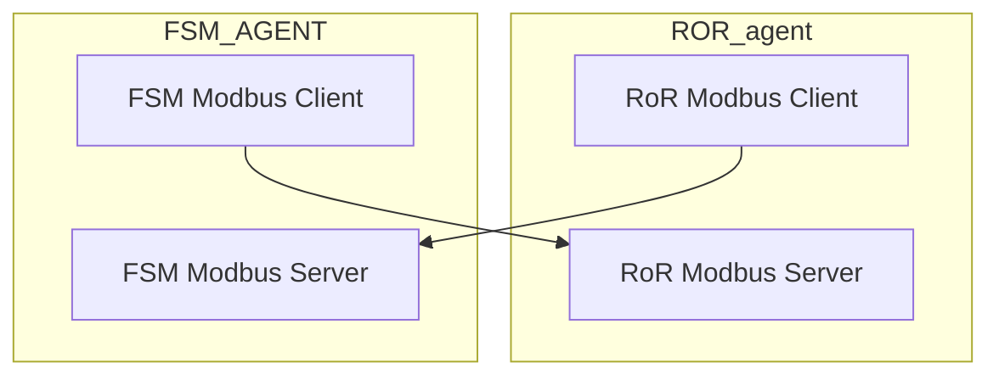

<!--START_SECTION:waka-->

```text
⌚︎ fuseau horaire: Asia/Kolkata

💬 Langages de programmation: 
JavaScript               8 hrs 10 mins       ██████████████░░░░░░░░░░░   56.72% 
Dart                     2 hrs 2 mins        ███░░░░░░░░░░░░░░░░░░░░░░   14.16% 
Java                     1 hr 21 mins        ██░░░░░░░░░░░░░░░░░░░░░░░   9.4% 
YAML                     47 mins             █░░░░░░░░░░░░░░░░░░░░░░░░   5.48% 
JSON                     43 mins             █░░░░░░░░░░░░░░░░░░░░░░░░   5.05%

🔥 Éditeurs de code: 
WebStorm                 9 hrs 13 mins       ████████████████░░░░░░░░░   64.07% 
Android Studio           5 hrs 10 mins       █████████░░░░░░░░░░░░░░░░   35.88% 
PhpStorm                 0 secs              ░░░░░░░░░░░░░░░░░░░░░░░░░   0.05%

🐱‍💻 projets: 
airline-module           6 hrs 51 mins       ████████████░░░░░░░░░░░░░   47.59% 
invoice_app              2 hrs 29 mins       ████░░░░░░░░░░░░░░░░░░░░░   17.24% 
E-Invoice Verify         1 hr 20 mins        ██░░░░░░░░░░░░░░░░░░░░░░░   9.31% 
cable_socket             1 hr 15 mins        ██░░░░░░░░░░░░░░░░░░░░░░░   8.74% 
invoice_app_1            1 hr 3 mins         █░░░░░░░░░░░░░░░░░░░░░░░░   7.39%

💻 système opérateur: 
Windows                  14 hrs 24 mins      █████████████████████████   100.0%

```

<!--END_SECTION:waka-->

