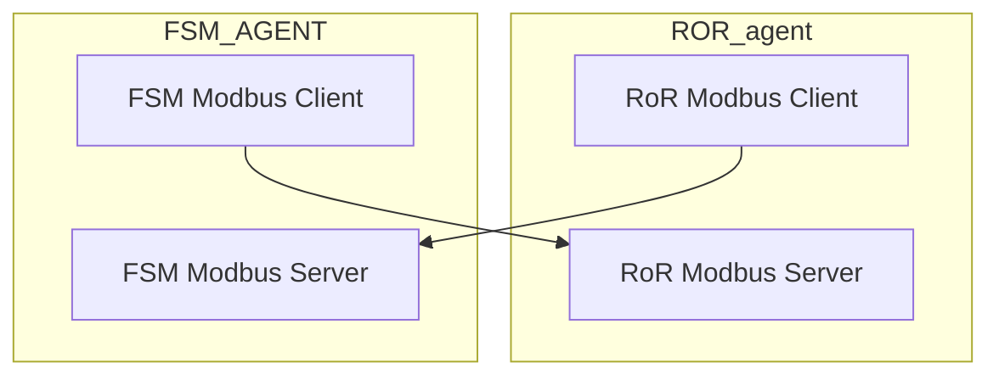

```mermaid
flowchart TB
    subgraph ROR_agent
    m1[RoR Modbus Server]
    m2[RoR Modbus Client]
    end
    subgraph FSM_AGENT
    m2 --> m3[FSM Modbus Server]
    m4[FSM Modbus Client] -->m1
    end
```
---
